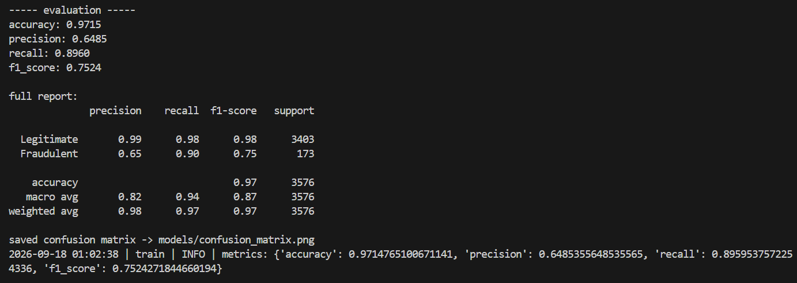
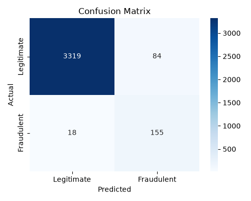
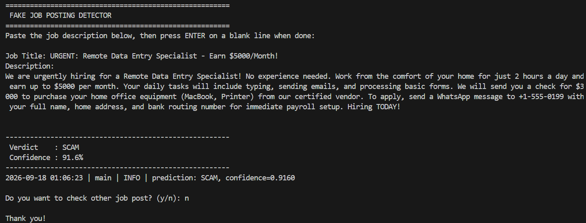
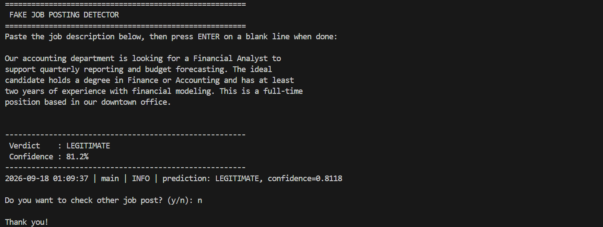

# Fake Job Posting Detector

## Project Title

**Fake Job Posting Detector** — a command-line tool that predicts whether a job listing is genuine or a scam, using a Logistic Regression model trained on real-world job posting data.

## Overview

The issue of job scams is common in the modern world, and inexperienced workers are especially vulnerable since they have little knowledge of typical job offers and may be unable to differentiate real job listings from scams. To address this issue, I have designed and implemented an application that determines whether a particular job posting is a scam or legitimate. The program takes a text of the job offer, cleans and tokenizes the data, assigns weights to terms based on the TF-IDF algorithm, and utilizes a classification model trained on 18000 real and fake job advertisements.

The model employs a Logistic Regression algorithm and is trained on a dataset comprising 18000 entries, half of which are real job listings and half are scams. The application is relatively simple to use as it only requires inputting the job advertisement text and pressing the Enter key. The results are displayed right after the calculation is completed. The code itself does not require heavy computations or advanced algorithms – instead, it is written in Python and uses the scikit-learn library. The project was created for an AI and ML fundamentals course as an exercise to learn the basics of the language and the principles of machine learning modeling.

## Features

- Cleans and preprocesses job ad text by filtering out noise and stopwords

- Converts the preprocessed text into TF-IDF features using unigrams and bigrams

- Trains the Logistic Regression algorithm with class balancing to handle the dataset imbalance

- Evaluates the performance of the trained model by calculating accuracy, precision, recall and F1-score

- Saves the confusion matrix as an image for easy visual inspection

- Identifies and displays the most common words and phrases used in the model for each class

- Saves the trained model and vectorizer object for future use

- Creates a command-line interface for the user to paste job ad and receive prediction

- Stores training logs and prediction results in a file for later review and debugging

- Has unit tests that verify the text preprocessing steps and check if the model and vectorizer can be loaded properly

## Technologies / Tools Used

| Category | Tool |
|---|---|
| Language | Python 3.10+ |
| ML library | scikit-learn (Logistic Regression, TF-IDF) |
| Data handling | pandas |
| Model persistence | joblib |
| Evaluation plots | matplotlib, seaborn |
| Testing | pytest |
| Version control | Git and GitHub |

## Project Structure

```
Fake-Job-Detector-ML/
├── data/                    # upload the Kaggle CSV here (not committed to the repo)
├── models/                  # trained model + confusion matrix is getting saved here
├── src/
│   ├── data_loader.py       # loads & validates the raw data CSV file
│   ├── text_cleaner.py      # text cleaning + TF-IDF vectorization is done here
│   ├── classifier.py        # Logistic Regression wrapper
│   ├── evaluator.py         # accuracy/F1all/precission + confusion matrix -> helps to evaluate the model
│   ├── model_saver.py       # saves/loads model+vectorizer as one bundle
│   ├── feature_analyzer.py  # shows which words drive predictions
│   ├── utils.py             # shared config paths + logging setup
│   ├── train.py             # run this first to train the model
│   └── main.py               # run this file to actually use the tool in the terminal
├── tests/
│   ├── test_text_cleaner.py
│   └── test_model_saver.py
├── statement.md
├── README.md
├── requirements.txt
└── .gitignore
```

## Steps to Install & Run the Project

### 1. Clone the repository

```bash
git clone https://github.com/nandannikam/Fake-Job-Detector-ML.git
cd Fake-Job-Detector-ML
```

### 2. Create a virtual environment

**Windows (PowerShell):**
```powershell
python -m venv venv
Set-ExecutionPolicy -Scope Process -ExecutionPolicy Bypass
venv\Scripts\Activate.ps1
```

**macOS / Linux:**
```bash
python3 -m venv venv
source venv/bin/activate
```


### 3. Install the dependencies

```bash
pip install -r requirements.txt
```

### 4. Download the dataset

This project uses the **"Real / Fake Job Posting Prediction"** dataset from Kaggle:
https://www.kaggle.com/datasets/shivamb/real-or-fake-fake-jobposting-prediction

Download the CSV, rename it to `fake_job_postings.csv` if needed, and place it at:

```
data/fake_job_postings.csv
```

The dataset itself isn't included in the repo since it's not mine to redistribute — grab it directly from Kaggle.

### 5. Train the model

```bash
python src/train.py
```

This loads the dataset, cleans and vectorizes the text, trains the classifier, prints out the evaluation metrics, saves a confusion matrix image, and stores the trained model in `models/`.

### 6. Run the detector

```bash
python src/main.py
```

Paste in a job description when prompted, hit Enter on a blank line, and you'll get a verdict (`LEGITIMATE` or `SCAM`) with a confidence percentage.

## Instructions for Testing

Run the unit test suite from the project root:

```bash
python -m pytest tests/ -v
```

This runs tests covering the text-cleaning function and the model save/load round-trip, so you can confirm the core logic works on your machine before relying on it.


## Sample Inputs to Try

Here are a few example postings you can paste into `python src/main.py` to see how the tool responds. A mix of obvious scams and normal listings, so you can compare the outputs side by side.

### Likely to be flagged as SCAM

**Example 1 — fake work-from-home offer**
```
Congratulations! You've been selected for an exclusive work-from-home
position paying $5000 per week. No experience necessary. To claim your
spot, please wire a small processing fee of $50 to our HR department
today. Limited spots available, act now!
```


**Example 2 — vague "no skills needed" listing**
```
Amazing opportunity to make money fast from your phone. No skills or
experience required. Just pay a small registration fee to get started
and begin earning thousands within your first week.
```

### Likely to be flagged as LEGITIMATE

**Example 3 — standard tech job posting**
```
We are seeking a Software Engineer with 3+ years of experience in
Python and cloud infrastructure. Responsibilities include designing
scalable backend services, collaborating with the product team, and
participating in code reviews. Bachelor's degree in Computer Science
or related field required. Competitive salary and benefits package.
```

**Example 4 — standard finance role**
```
Our accounting department is looking for a Financial Analyst to
support quarterly reporting and budget forecasting. The ideal
candidate holds a degree in Finance or Accounting and has at least
two years of experience with financial modeling. This is a full-time
position based in our downtown office.
```


> **Note:** Predictions depend on the dataset the model was trained on, so exact confidence scores will vary. These examples are meant to demonstrate the range of inputs the tool is built to handle, not to guarantee a specific output every time.


## Screenshots


**Training output:**



**Confusion matrix:**



**CLI detecting a scam posting:**



**CLI detecting a legitimate posting:**



## Limitations

- The model works as well as the patterns found in the training data. New or more clever scam language might not be caught.
- Only posts, in the English language.
- This is a tool based on numbers, not a promise. It should be used as a thought not as something to rely on completely. Never give money or personal bank information to someone claiming to be a recruiter no matter what any tool says.

## Author

Name - Nandan Nikam <br>
Registration No.: - 25MIM10102 <br>
Course - Fundamentals in AI & ML <br>
Course code - CSA2001 <br>
